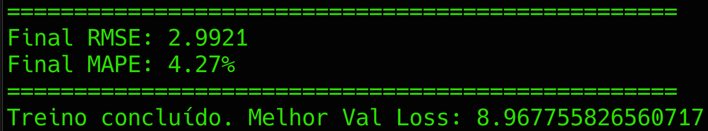

# INTRODUÇÃO
A seguir, um panorama geral deste projeto: um resumo de todas as etapas, componentes e objetivos, os detalhes e instruções específicas estão nas seções a seguir.

Este repositório implementa uma API RESTful de previsão de preços de ações que integra todo o ciclo de ciência de dados, desde a aquisição automática de dados históricos até o deploy em produção.

* **AQUISIÇÃO E PRÉ-PROCESSAMENTO**: a classe `Downloader` faz o download dos dados brutos (via `yfinance` ou outra fonte configurável) e os salva em disco para posterior processamento.

* **TREINAMENTO E MONITORAMENTO**: a classe Train orquestra o pipeline de treinamento de um modelo LSTM customizado em PyTorch, registrando parâmetros e métricas no MLflow para facilitar a reprodutibilidade e comparação de experimentos.

* **ORQUESTRAÇÃO**: a classe Pipeline reúne download, pré-processamento, treinamento e geração de artefatos em um fluxo único, com métodos claros para cada etapa.

* **DEPLOY E INFERÊNCIA**: com Flask, foram disponibilizados endpoints para iniciar novos treinamentos, consultar o status do sistema e, principalmente, gerar previsões futuras com base em janelas de séries temporais. Tudo isso empacotado em um container Docker pronto para ser escalado em qualquer ambiente.

A princípio, o modelo consegue prever até 10 dias de preços futuros de fechamento, usando os últimos 20 preços de fechamento para isso, o que pode ser alterado nos hiperparâmetros (exige-se retreino). O modelo usa apenas 1 tipo de ação específica, não sendo genêrico para todo e qualquer tipo de ação.


# ESTRUTURA DO PROJETO
O projeto tem a seguinte estrutura de diretórios:
```text
.
├── data/
├── img/
├── saved_weights/
├── src/
│   ├── deploy/
│   ├── services/
│   └── train/
└── statistics/
```

* `data/`: diretório onde ficam os arquivos brutos e/ou processados de séries históricas de preços. É aqui que o `Downloader` (em src/services) salva os CSVs originais para uso no treino e na inferência.

* `img/`: diretório que armazena as imagens do README.md.

* `saved_weights/`: diretório reservado para os pesos do modelo treinado (arquivos .pth ou similares). A classe Train grava aqui o checkpoint final (e, opcionalmente, intermediário) para posterior carregamento pelo serviço de deploy.

* `src/`: diretório que contém o código fonte do projeto em python3.

* `src/deploy/`: diretório que contém tudo relacionado ao deploy e inferência do modelo.

* `src/services/`: diretório destinado ao armazenamento de serviços e APIs externas usadas pelo sistema. Atualmente, o projeto usa apenas a classe `Downloader`, que encapsula a API do `yfinance`.

* `src/train/`: diretório que contém tudo relacionado ao modelo e ao seu treinamento, desde a definição de arquitetura da rede neural até o treinamento da mesma e definição de hiperparâmetros.

* `statistics/`: diretório onde ficam armazenados estatísticas gerais do modelo e os logs do MLflow.


# REGRAS DE NEGÓCIO DA API
O modelo segue algumas regras cujo conhecimento é essencial para o entendimento e o seu uso.

Primeiramente, o modelo é treinado apenas com uma ação. Por padrão, o modelo já vem treinado com as ações da `VALE3`, o que significa que faz sentido apenas usar o modelo para prever o preço da VALE3.

É possível mudar a ação em que o modelo é especialista por meio do retreinamento, nesse caso, ele vai ser treinado com a base de dados de preço da ação que você passar para ele no treinamento. Para isso, basta usar a rota /train da API ([veja mais na seção de API](#rotas-da-api)) passando o novo nome da ação e o intervalo de data que será usado no treinamento.

O motivo de se usar apenas 1 ação é que isso deixa o treinamento mais rápido e o modelo fica mais preciso, ou seja, mesmo em CPU, o modelo consegue ser treinado em poucos minutos.


## Datas
As datas que o projeto usa estão no formato [ISO 8601](https://www.iso.org/iso-8601-date-and-time-format.html), que estão na forma `YYYY-MM-DD`, assim, quando for enviar datas para a API ou ver o tratamento de datas no código, considere o formato ISO 8601.


## Nome das ações
As ações seguem a nomenclatura da B3, o que significa que a API usa o mesmo nome que está na B3. Como o `yfinance` usa um ".SA" no final das ações brasileiras, é possível passar para a API tanto `VALE3`, como `VALE3.SA`, por exemplo.


# TECNOLOGIAS UTILIZADAS
O projeto utilizou, dentre outras, as principais tecnologias/bibliotecas:
* **[Docker](https://www.docker.com/)**: plataforma de containerização que empacota a aplicação, suas dependências e configurações em imagens isoladas. No projeto, o docker foi usado para garantir que a API e o pipeline de ML rodem de forma consistente em qualquer ambiente, facilitando deploy e escalonamento.

* **[Flask](https://flask.palletsprojects.com/en/stable/)**: micro-framework web em Python, leve e extensível, usado para criar a API RESTful. Nesse projeto, Flask expõe endpoints para treinamento, predição e estatísticas do modelo.

* **[gunicorn](https://gunicorn.org/)**: servidor WSGI (Web Server Gateway Interface) para aplicações Python, responsável por gerenciar múltiplos processos/workers e servir a aplicação Flask em produção com maior desempenho e tolerância a falhas.

* **[pytorch](https://pytorch.org/)**: biblioteca de deep learning em Python, com suporte a tensores e diferenciação automática. PyTorch foi usado para implementar e treinar o modelo LSTM, definindo arquitetura, cálculo de perdas (RMSE, MAPE) e loops de otimização.

* **[MLflow](https://mlflow.org/)**: plataforma de gestão de experimentos de machine learning que registra parâmetros, métricas, artefatos e modelos. Integrado no pipeline de treinamento, o MLflow permite comparar diferentes runs, versionar hiperparâmetros e reproduzir resultados de forma simples.


# COMO RODAR LOCALMENTE
Recomenda-se usar o docker para rodar o projeto localmente independentemente do SO que você esteja usando (Windows, Linux ou MacOS)

Para rodar o projeto, siga os passos abaixo:

1. Faça o download desse projeto.

2. Se você ainda não tiver o docker instalado, baixe-o no [site oficial](https://docs.docker.com/get-started/get-docker/).

3. Na raiz do projeto, rode o seguinte comando para fazer o build do Dockerfile, certifique-se de ter ao menos 10 GB livres de armazenamento:
```bash
docker build -t modelo-deep-learning .
```

4. Certifique-se de que a porta 5000 esteja liberada na sua máquina e rode o container com o seguinte comando:
```bash
docker run \
    -dp 5000:5000 \
    --name api \
    modelo-deep-learning
```

# ROTAS DA API
A API expõe três endpoints principais para treinar o modelo, gerar previsões e consultar estatísticas de experimentos. Em todos os exemplos abaixo, o host base é http://localhost:5000.

* POST `/train`: 
  * Descrição: 
  Treina o modelo LSTM para o ticker e período informados, atualiza os pesos em saved_weights/ e faz deploy do novo modelo. Essa rota pode demorar alguns minutos para devolver a resposta, já que o treinamento do modelo pode demorar mais ou menos a depender das configurações de hardware da máquina em que foi feito o deploy.

  * Body:
  ```json
  {
    "stock"     : "PETR4",
    "inicio"    : "YYYY-MM-DD",
    "fim"       : "YYYY-MM-DD"
  }
  ```
  Precisa de um JSON com 3 campos: `stock`, `inicio` e `fim`.
  `stock`: é ticker do ativo e pode ou não vir com o sufixo '.SA'.
  `inicio`: data de início de cotação para o treinamento.
  `fim`: data de fim de cotação para o treinamento.


  * Resposta de sucesso:
  ```json
  {
    "message": "Treino concluido com sucesso! O modelo foi atualizado!"
  }
  ```

  * Exemplo de uso (curl):
  ```bash
  curl -X POST http://localhost:5000/train \
  -H "Content-Type: application/json" \
  -d '{
    "stock":  "VALE3",
    "inicio": "2020-01-01",
    "fim":    "2025-07-28"
  }'
  ```


* POST `/predict`: 
  * Descrição: 
  Gera previsão de preços com o modelo atualmente em produção. Se o modelo ainda não estiver deployado, o endpoint faz deploy automático antes de prever. O retorno é um JSON com os próximos 10 preços de fechamento da ação.

  * Body:
  ```json
  {
    "stock": "VALE3",
  }
  ```
  Só precisa do ticker da ação em que o modelo foi treinado. Pode-se colocar o '.SA' ou não no final do ticker.

  * Exemplo de resposta de sucesso
  ```json
  {
    "preco": "[55.52, 55.28, 55.44, 55.38, 55.65, 55.59, 55.82, 55.38, 55.59, 55.63]"
  }
  ```

  * Exemplo de uso (curl):
  ```bash
  curl -X POST http://localhost:5000/predict \
  -H "Content-Type: application/json" \
  -d '{
    "stock": "VALE3"
  }'
  ```

* GET `/statistics`
  * Descrição:
  Retorna um JSON com todas as estatísticas de experimentos registrados no MLflow (runs, parâmetros, métricas e timestamps).

  * Request:
  Sem body ou parâmetros.

  * Exemplo de resposta de sucesso
  ```json
  {
    "experiments": [
      {
        "artifact_uri": "file:///app/statistics/638177982245090140",
        "experiment_id": "638177982245090140",
        "lifecycle_stage": "active",
        "name": "2025-07-29-15:06:30",
        "runs": [
          {
            "artifact_uri": "file:///app/statistics/638177982245090140/d744f04f18c940428fa2a951b345caca/artifacts",
            "end_time": 1753801669223,
            "metrics": {
              "best_val_loss": 9.407169958725763,
              "final_mape": 4.3126071617007256,
              "final_rmse": 3.063501184276288,
              "history_train_loss": 859.9665283330822,
              "history_val_loss": 677.8857664466356,
              "mape_step_1": 4.484681785106659,
              "mape_step_10": 4.157597199082375,
              "mape_step_2": 4.424845799803734,
              "mape_step_3": 4.374302551150322,
              "mape_step_4": 4.3496400117874146,
              "mape_step_5": 4.37844879925251,
              "mape_step_6": 4.273915663361549,
              "mape_step_7": 4.211739078164101,
              "mape_step_8": 4.257416725158691,
              "mape_step_9": 4.2134840041399,
              "rmse_step_1": 3.294871512470768,
              "rmse_step_10": 2.8442083974422574,
              "rmse_step_2": 3.2504270713146384,
              "rmse_step_3": 3.2042310340345646,
              "rmse_step_4": 3.13973212004536,
              "rmse_step_5": 3.090356371924307,
              "rmse_step_6": 3.0218948253150892,
              "rmse_step_7": 2.9672174613930475,
              "rmse_step_8": 2.9323836877363183,
              "rmse_step_9": 2.889689361086527,
              "train_loss": 74.97250994418529,
              "training_time": 78.58659790689126,
              "val_loss": 12.38049417687941
            },
            "params": {
              "batch_size": "32",
              "device": "cpu",
              "dropout": "0.5",
              "future_steps": "10",
              "hidden_size": "40",
              "learning_rate": "0.0005",
              "n_epochs": "150",
              "seed": "6544",
              "sequence_length": "20",
              "train_size": "0.7",
              "weight_decay": "1e-05"
            },
            "run_id": "d744f04f18c940428fa2a951b345caca",
            "start_time": 1753801590639,
            "status": "FINISHED",
            "tags": {
              "mlflow.runName": "smiling-bass-287",
              "mlflow.source.name": "/usr/local/bin/flask",
              "mlflow.source.type": "LOCAL",
              "mlflow.user": "root"
            }
          }
        ]
      }
    ]
  }
  ```

  * Exemplo de uso (curl):
  ```bash
  curl http://localhost:5000/statistics
  ```


# ARQUITETURA DO MODELO E CAMADAS
O modelo implementado é uma LSTM com 5 camadas, sendo 2 camadas LSTM, 2 camadas de Dropout e 1 camada Linear. 

A LSTM foi estruturada conforme o diagrama a seguir:


# HIPERPARÂMETROS USADOS E TREINAMENTO
O modelo foi projetado para ser otimizado no treinamento, de modo que consiga ser treinado na maioria das CPUs em apenas alguns minutos. Por esse motivo, foram adotadas algumas medidas que aceleraram muito o tempo de treino e que geraram pouco ou nenhum impacto relevante no desempenho do modelo, dentre elas, pode-se citar:
* Usar apenas a feature 'Close', as outras features não mostraram aumento relevante no desempenho do modelo.

* Treinar o modelo apenas para 1 ação específica. Treinar o modelo com várias ações significa ter mais dados históricos e consequentemente mais tempo de treinamento.

* Reduzir a janela de dados históricos. Foi observado que treinar o modelo com dados de 2010 a 2025 teve praticamente o mesmo desempenho que treiná-lo com uma janela de 2020 a 2025, o que reduz o tempo de treinamento. Por isso, foram usados dados de 2020 a 2025.

O modelo foi treinado de modo que consiga receber os últimos 20 preços de fechamento da ação (sequence_length=20) e retornar quais serão os próximos 10 preços de fechamento (future_steps=10).

Foi criada uma classe chamada Hparams, que tem o objetivo de centralizar os hiperparâmetros que serão usados pelo modelo.

* Os hiperparâmetros globais usados foram:
  * Épocas de treinamento:  150
  * batch_size:             32
  * learning_rate:          0.0005
  * weight_decay:           0.00001
  * seed:                   6544
  * train_size:             0.7 
  * optimizer:              Adam
  * loss function:          MSE

* Hiperparâmetros usados por camada
  * Primeira camada - LSTM:
    * input_size:   1
    * hidden_size:  40
    * num_layers:   1
    * batch_first:  True

  * Segunda camada - Dropout:
    * p: 0.1

  * Terceira camada - LSTM:
    * input_size:   40,
    * hidden_size:  40,
    * num_layers:   1,
    * batch_first:  True

  * Quarta camada - Dropout:
    * p: 0.1

  * Quinta camada - Linear:
    * input_size:   40
    * hidden_size:  10


# RESULTADOS OBTIDOS
Por padrão, o modelo vem treinado para prever o preço das ações da VALE3, nesse caso, as métricas e resultados obtidos vão ser em relação a esse ativo financeiro. Foram utilizados RMSE e MAPE para medir o desempenho.

Considerando a arquitetura da rede apresentada na seção [arquitetura do modelo e camadas](#arquitetura-do-modelo-e-camadas) e também os hiperparâmetros e configurações apresentados na seção [hiperparâmetros usados e treinamento](#hiperparâmetros-usados-e-treinamento), foi possível obter os seguintes resultados:

RMSE = 2.9921
MAPE = 4.27%
MSE = 8.967755826560717

Interpretando os resultados obtidos, pode-se concluir que o modelo erra o preço da VALE3 para os próximos 10 dias, em média, em R$2.99, ou ainda em 4.27% em relação ao preço atual (preço atual que a VALE3 estava quando o modelo fez a previsão).

# LICENÇA
Este projeto está licenciado sob a [MIT License](LICENSE).


